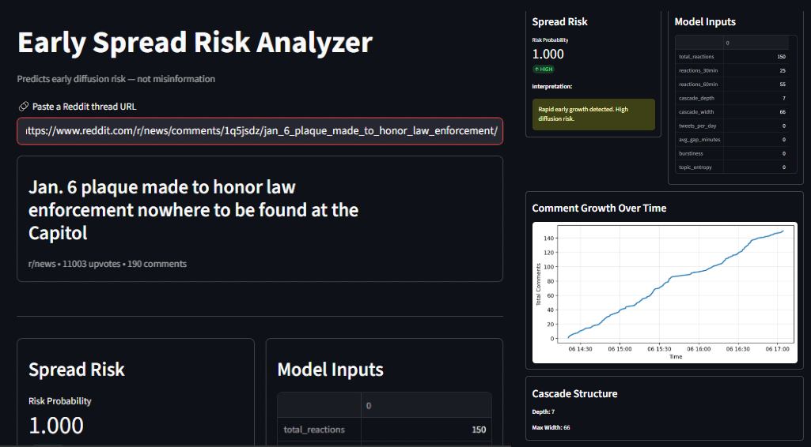
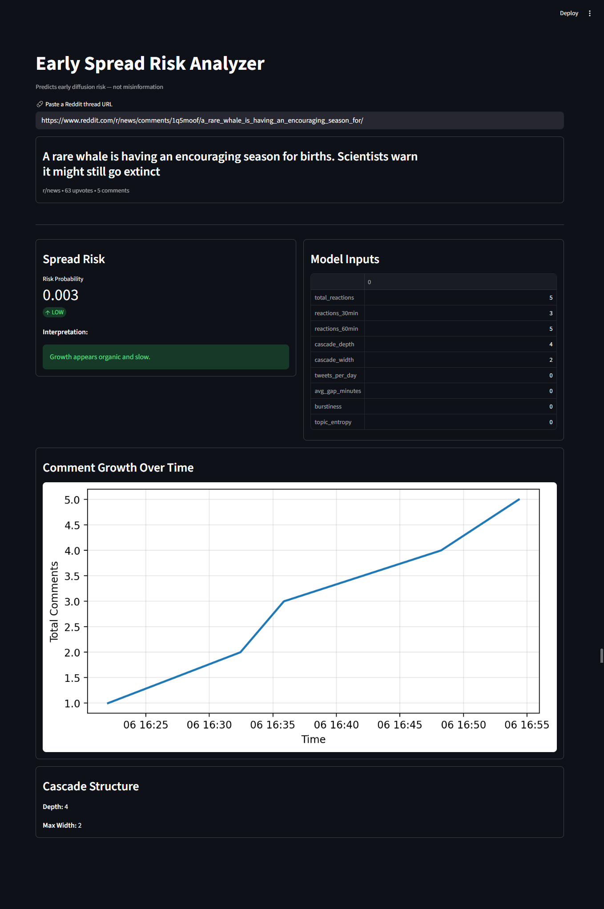
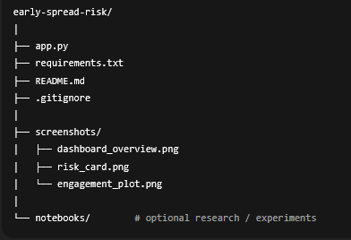

#  Early Spread Risk Analyzer

An end-to-end Machine Learning system that estimates the **early diffusion (spread) risk** of online discussions using **temporal and structural engagement patterns**.

> ⚠️ **Important**  
> This project does **NOT** detect misinformation or judge factual correctness.  
> It predicts **early spread risk** — i.e., whether a discussion is accelerating unusually fast in its initial phase.

---

##  Motivation

Online discussions can escalate rapidly before humans or systems can react.  
Instead of asking *“Is this true?”*, this project asks:

> **“Is this discussion spreading abnormally fast early on?”**

Early detection of high-risk diffusion patterns is useful for:
- moderation triage
- social dynamics research
- early warning systems
- ML system design demonstrations

---

##  What This Project Does

Given a **Reddit thread URL**, the system:

1. Fetches live discussion data using Reddit’s API
2. Extracts **early engagement features**
3. Builds **cascade structure features**
4. Uses a trained ML model to estimate **spread risk probability**
5. Visualizes the results in an interactive dashboard

---

## Interactive Dashboard

The project includes a **Streamlit-based dashboard** where you can:

- Paste a Reddit thread URL
- View engagement growth over time
- Inspect cascade structure (depth & width)
- See the predicted spread risk score
- Understand which features influenced the prediction

### Screenshots





<!--  -->


---

##  Model Overview

- **Training Data**
  - PHEME dataset
  - Extended PHEME dataset
- **Task**
  - Binary classification: early spread risk vs normal spread
- **Model**
  - Logistic Regression
  - Feature scaling applied
- **Evaluation**
  - ROC-AUC ≈ 0.99 on held-out test data
  - Label-shuffling sanity checks confirm non-trivial learning

---

##  Features Used

### Diffusion / Structural Features
- Total reactions
- Reactions in first 30 minutes
- Reactions in first 60 minutes
- Cascade depth
- Cascade width

### User / Content Features *(when available)*
- Posting burstiness
- Average reaction gaps
- Topic entropy (lexical diversity proxy)

> Missing features are safely handled and defaulted where appropriate.

---

##  What This Model Does NOT Do

- ❌ Does not verify factual correctness  
- ❌ Does not label content as misinformation  
- ❌ Does not predict popularity  
- ❌ Does not moderate or censor content  

This is a **risk estimation system**, not a truth engine.

---

##  Example Interpretation

| Scenario | Early Activity | Risk |
|--------|---------------|------|
| Slow growth over hours | Low early engagement | Low risk |
| Rapid spike within 60 minutes | High early acceleration | High risk |

High risk ≠ bad content.  
It simply means **attention is accelerating quickly**.

---

## 🛠️ Local Setup

### 1. Clone the repository
```bash
git clone https://github.com/Sayangithub23/early-spread-risk.git
cd early-spread-risk
```

### 2. Install dependencies
```pip install -r requirements.txt ```

### 3. Create a .env file
```
REDDIT_CLIENT_ID=your_client_id
REDDIT_CLIENT_SECRET=your_client_secret
REDDIT_USER_AGENT=spread-risk-demo
```
⚠️ `.env` is ignored by Git and must NOT be committed.

### 4. Run the dashboard
`streamlit run app.py`

Open your browser at: (http://localhost:8501)

### Security & Privacy
- No credentials are committed to the repository
- API keys are loaded via environment variables
- The system runs in read-only Reddit mode
- No user data is stored permanently

### Repository Structure
 


##### Final Note
This project focuses on problem framing, responsible ML design, and real-world data handling rather than leaderboard chasing.

# If you’re interested in:
- early-warning systems
- diffusion modeling
- applied ML engineering
- social platform dynamics

this project is meant to be a transparent, practical demonstration.

## ⭐ If you find this useful, feel free to star the repo.